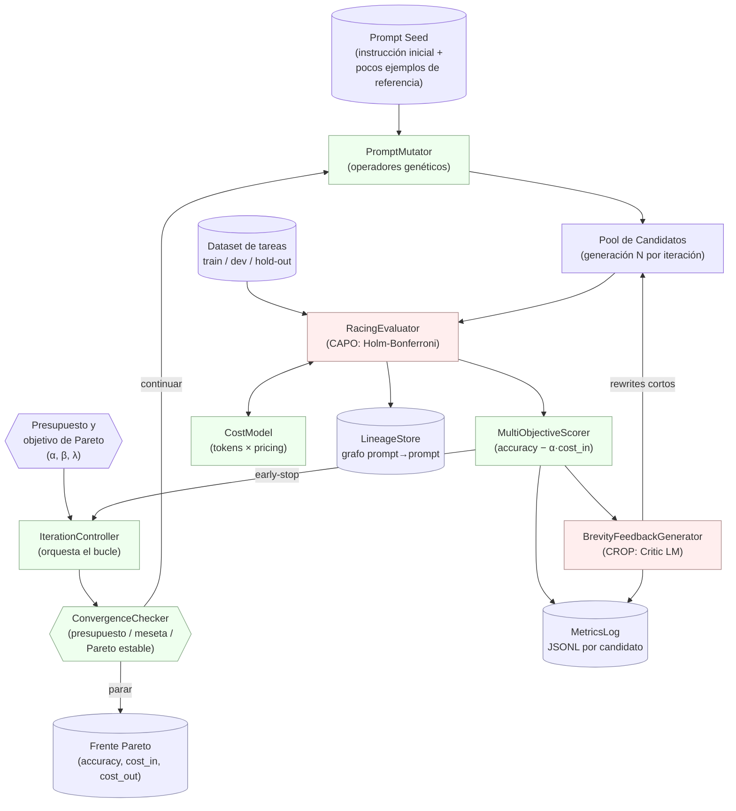

# Arquitectura de Software: Optimizador de Prompts Integral y Consciente del Costo

> **Propósito.** Unificar los enfoques de **CAPO** (Cost-Aware Prompt Optimization, centrado en *costo de entrada* vía Racing algorítmico) y **CROP** (Cost-Regularized Optimization of Prompts, centrado en *costo de salida* vía retroalimentación textual de un Critic LM) en un único pipeline declarativo-iterativo que produce prompts Pareto-óptimos `(accuracy, cost_in, cost_out)`.
>
> **Nota metodológica.** Este documento es un **diseño de alto nivel** — define módulos, contratos de datos, flujo de control y supuestos de stack. No incluye código de implementación todavía. Tras la aprobación del diseño se derivará una especificación de interfaz (proto/JSON-Schema/Pydantic) y un plan de hitos.

---

## 1. Diagrama de Flujo de Datos (Mermaid.js)

**Lectura del flujo.**
1. El *PromptMutator* genera una generación de variantes desde el *seed* o desde los mejores del frente Pareto actual.
2. Cada candidato entra al *RacingEvaluator*, que evalúa en mini-batches crecientes y descartando a los perdedores (Holm-Bonferroni) — esto minimiza llamadas caras a LLM.
3. El *MultiObjectiveScorer* computa la función objetivo CAPO (accuracy menos costo de entrada penalizado).
4. El *BrevityFeedbackGenerator* (CROP) toma las salidas largas del modelo objetivo y emite *rewrites* más breves + puntaje de brevedad, que se inyectan como retroalimentación para la siguiente generación.
5. El *IterationController* decide si continuar (vuelve al Mutator) o parar y emitir el **frente Pareto** final.

---

## 2. Desglose de Módulos

### 2.1 `PromptMutator`
| Aspecto | Detalle |
|---|---|
| **Responsabilidad** | Aplicar operadores de mutación genética sobre prompts padre. |
| **Operadores previstos** | `paraphrase`, `add_constraint`, `swap_fewshot`, `toggle_cot`, `compact_instructions`, `seed_from_history`. |
| **Entradas** | Lista de prompts padre, presupuesto restante, lista de operadores habilitados. |
| **Salidas** | `List[Candidate]` con campo `parent_id` trazable. |
| **Estado interno** | Caché LRU de mutaciones vistas para diversidad. |

### 2.2 `RacingEvaluator` (núcleo CAPO)
| Aspecto | Detalle |
|---|---|
| **Responsabilidad** | Evaluar candidatos en paralelo sobre mini-batches crecientes; descartar perdedores con Holm-Bonferroni cuando su margen de ventaja es estadísticamente significativo. |
| **Entradas** | Pool de candidatos, dataset etiquetado, `min_batch`, `max_batch`, tamaño de efecto mínimo. |
| **Salidas** | Subconjunto superviviente + métricas por candidato (`mean_acc`, `p_value`, `rounds_used`). |
| **Garantía** | Reduce ~70 % de las llamadas al LLM manteniendo ranking de calidad (supuesto del paper CAPO). |
| **Estado** | Stream asíncrono; necesita *cancellation tokens* para interrumpir perdedores temprano. |

### 2.3 `MultiObjectiveScorer`
| Aspecto | Detalle |
|---|---|
| **Responsabilidad** | Calcular la función objetivo combinada. Soporta CAPO puro `(acc − α·cost_in)` y extensiones multi-objetivo vía suma ponderada o Pareto dominance real. |
| **Entradas** | Métricas crudas del candidato, vector de pesos `(α, β)`. |
| **Salidas** | `score`, vector `(accuracy, cost_in, cost_out)`. |

### 2.4 `BrevityFeedbackGenerator` (núcleo CROP)
| Aspecto | Detalle |
|---|---|
| **Responsabilidad** | Para las salidas largas, generar (a) una versión más breve y (b) un puntaje cualitativo de brevedad. |
| **Modelo interno** | "Critic LM" — puede ser el mismo proveedor o uno más barato/rápido. |
| **Entradas** | Pares `(prompt, output)` consumidos en exceso de tokens. |
| **Salidas** | `feedback_text`, `rewritten_output`, `brevity_score` (0–1). |
| **Acoplamiento** | Conecta con el *CostModel* para decidir cuándo una salida merece retroalimentación. |

### 2.5 `CostModel`
| Aspecto | Detalle |
|---|---|
| **Responsabilidad** | Centralizar la medición de tokens y costo monetario. |
| **Fuentes** | `tiktoken` para tokens lógicos (verificar drift), conteo reportado por API cuando esté disponible, tabla de precios por proveedor. |
| **Salidas** | `cost_in`, `cost_out`, `cost_total` por `(prompt, output)`. |

### 2.6 `LineageStore`
| Aspecto | Detalle |
|---|---|
| **Responsabilidad** | Mantener el grafo `prompt → {children, scores, cost}`. |
| **Consultas típicas** | "¿De qué seed viene este candidato?", "¿Cuál es el camino más corto a un prompt Pareto?", "Eliminar rama subóptima". |
| **Persistencia** | SQLite o Postgres; opcional Neo4j si la profundidad del árbol lo justifica. |

### 2.7 `IterationController`
| Aspecto | Detalle |
|---|---|
| **Responsabilidad** | Orquestar el bucle principal, gestionar presupuesto (tokens USD / llamadas), y exponer hooks para reintentos, logging y checkpointing. |
| **Política** | Configurable: greedy, ε-greedy, NSGA-II para verdadero multi-objetivo. |
| **Salidas** | `next_generation`, `stop_signal`. |

### 2.8 `ConvergenceChecker`
| Aspecto | Detalle |
|---|---|
| **Responsabilidad** | Decidir cuándo detener la optimización. |
| **Criterios** | (a) presupuesto agotado, (b) mejora marginal < ε en K rondas consecutivas, (c) frente Pareto estable por N iteraciones, (d) presupuesto de tiempo cumplido. |

---

## 3. Gestión de Estado y Persistencia

| Tipo de dato | Tamaño típico | Volumen esperado | Almacén propuesto | Justificación |
|---|---|---|---|---|
| **Lineaje prompt→prompt + scores** | ~2 KB/candidato | 10³–10⁵ candidatos | **Postgres** (esquema relacional simple) | Índices en `parent_id` y `score`; consultas SQL ad-hoc fáciles. |
| **Métricas crudas por candidato** | ~5 KB (JSONL con logs por batch) | Miles de archivos | **JSON Lines en object storage** (S3/MinIO) o filesystem local si volumen bajo | Anexo al registro relacional por FK. |
| **Frente Pareto** | Decenas | Constante | **SQLite embebido** (versión single-user) o tabla en Postgres | Lectura barata para UI/export. |
| **Estado en vivo de iteración** | KB | Único | **Redis opcional** (checkpointing) o archivos `.pkl`/JSON | Permite reanudar corridas largas. |
| **Grafo evolutivo profundo (>500 niveles)** | Grande | Raro | **Neo4j opcional** | Para visualización tipo "árbol genealógico" o análisis de operadores. |
| **Embeddings de prompts (few-shot retrieval)** | ~1.5 KB/vector | Miles | **Chroma o Qdrant opcional** | Solo si se activa retrieval-augmented mutation. |

**Reglas de retención.**
- Crudos `JSONL`: 90 días, luego compresión cold-storage.
- Tabla relacional: indefinida (costos de almacenamiento despreciables).
- Snapshots del frente: versionados en Git LFS o DVC si se quiere reproducibilidad experimental.

---

## 4. Stack Tecnológico Recomendado

### 4.1 Núcleo de orquestación
| Componente | Recomendación | Por qué |
|---|---|---|
| **DSPy** (`dspy` ≥ 2.5) | Adoptar como framework de optimización declarativa. Sus módulos `Predict`, `ChainOfThought`, `Signature` mapean 1:1 con nuestros `PromptMutator`. Compatible con assert/optimize. |
| **LiteLLM** (`litellm`) | Capa de abstracción multi-proveedor (OpenAI, Anthropic, Bedrock, vLLM local). Maneja JSON mode, retries, streaming, costos. |
| **Pydantic v2** | Contratos de datos y validación. Generación de JSON-Schema para I/O entre módulos. |

### 4.2 Computación numérica y estadística
| Componente | Uso |
|---|---|
| **scipy.stats** | Holm-Bonferroni y Sidak para el RacingEvaluator. |
| **statsmodels** | (Opcional) Familias de tests alternativas (Wilcoxon pareado, etc.) si el dataset es chico. |
| **pandas / polars** | Análisis offline de corridas y comparaciones A/B. |

### 4.3 Conteo de tokens y pricing
| Componente | Uso |
|---|---|
| **tiktoken** (o equivalente por proveedor) | Conteo local; **validar contra la API** porque el drift entre tokenizadores locales y de proveedor es una fuente silenciosa de errores de presupuesto. |
| **`litellm.cost_per_token`** | Tabla de precios unificada; *snapshot* diario para auditoría. |

### 4.4 Resiliencia y concurrencia
| Componente | Uso |
|---|---|
| **tenacity** | Retry policies con backoff exponencial por tipo de error (rate-limit vs. timeout vs. 5xx). |
| **ratelimit / aiolimiter** | Token-bucket local antes de llamar a la API. |
| **asyncio + httpx** | Concurrencia masiva en el Racing (varios candidatos en paralelo). |
| **TQDM / rich** | Barras de progreso y reporte en CLI. |

### 4.5 Tracking de experimentos (opcional pero recomendado)
| Componente | Uso |
|---|---|
| **MLflow** o **Weights & Biases** | Versionado de prompts, scores, hiperparámetros, datasets. Integración directa con DSPy posible vía callbacks. |

### 4.6 Calidad y observabilidad
| Componente | Uso |
|---|---|
| **OpenTelemetry** | Tracing distribuido (Racing → MOScorer → BFG) para diagnosticar latencia. |
| **pydantic-settings** | Configuración 12-factor (YAML/env). |
| **pytest + hypothesis** | Tests unitarios + property-based para invariantes (p. ej. "ningún score puede ser negativo si todos los pesos lo son"). |

### 4.7 Lenguaje y runtime
- **Python 3.11+** (tipos modernos, asyncio maduro, performance).
- Empaquetado: **uv** o **poetry**; contenedores opcionales.
- Si la paralelización del Racing escala más allá de unos cientos de candidatos en paralelo, considerar **Ray** sobre asyncio.

> **Principio rector:** preferir proveedores de infraestructura que ya tienen DSPy/LiteLLM probados en producción. Evitar reinventar el *prompt pipeline*; ser una aplicación alrededor del bucle Racing + CROP.

---

## 5. Cuellos de Botella Críticos y Mitigaciones

### 5.1 Rate-limits de proveedor
**Riesgo:** un Racing con 64 candidatos en paralelo contra GPT-4o o Claude satura las cuotas por minuto y devuelve 429s en cascada.
**Mitigaciones:**
- Token-bucket local con `aiolimiter`, ajustado al *RPM/TPM* del tier de cuenta.
- Backoff adaptativo por proveedor en `tenacity`.
- Pipelining por lotes pequeños (5–10 candidatos concurrentes), no ráfagas.
- *Auto-fallback* a un proveedor alternativo vía `litellm.fallbacks` cuando se agota la cuota.

### 5.2 Latencia del evaluador (LLM-as-judge vs. exact match)
**Riesgo:** la métrica de calidad es a menudo otro LLM (LLM-as-judge), duplicando el costo y la latencia.
**Mitigaciones:**
- Preferir **métricas exactas** cuando el dominio lo permita (clasificación cerrada, regex, código ejecuta tests).
- Para CROP, una variante con métricas exact-match + heurística de longitud basta en muchos casos.
- Si el judge es inevitable: usar un modelo más barato (Haiku, GPT-4o-mini) y validar contra gold-standard periódicamente para detectar drift.

### 5.3 Convergencia prematura del Racing
**Riesgo:** Holm-Bonferroni descarta candidatos en lotes muy tempranos por ruido, eliminando variantes buenas que habrían destacado con más datos.
**Mitigaciones:**
- Tamaño mínimo del primer mini-batch debe ser ≥ `(k * log α / δ²)` estilo Hoeffding adaptado al número de candidatos pareados.
- Re-checkpointing: si en una iteración posterior aparece un candidato del mismo linaje con buen score, re-promoverlo.
- Logging del `p_value` final; descartar solo cuando la confianza es robusta.

### 5.4 Drift de tokens entre tokenizador local y del proveedor
**Riesgo:** `tiktoken` no coincide con el conteo real del proveedor (especialmente Anthropic, Bedrock, modelos custom). El presupuesto se subestima/sobreestima.
**Mitigaciones:**
- Sonda inicial de calibración: medir 100 prompts de muestra y guardar el ratio `local/provider`.
- Usar siempre el `usage` reportado por la respuesta en `CostModel`; el local solo para *búsqueda* previa.
- Si un proveedor no reporta usage, al menos usar el conteo que expone `litellm.completion(...).usage`.

### 5.5 Calidad de los *few-shot* mutados
**Riesgo:** Swap aleatorio de ejemplos degrada el prompt. CAPO reportó que pocos shots (≤2) suelen ser óptimos, pero no es universal.
**Mitigaciones:**
- Limitar el operador `swap_fewshot` a intercambios validados semánticamente (embedding-similarity threshold).
- Operador `compact_examples` que quita ejemplos redundantes descubiertos por similitud coseno.
- A/B por iteración: nunca reemplazar el pool entero, mantener un *elite* (top-k invicto) entre generaciones.

### 5.6 Costos ocultos del CoT
**Riesgo:** activar CoT aumenta *tokens de salida* sin ganancia proporcional de accuracy en tareas simples.
**Mitigaciones:**
- Operador `toggle_cot` que prueba ambos modos como dos candidatos distintos; la MultiObjectiveScorer penalizará automáticamente al perdedor.
- Política adaptativa: CoT solo cuando el *FewShotPrompt* supera un umbral de accuracy crudo.

### 5.7 Determinismo y reproducibilidad
**Riesgo:** APIs estocásticas (temperature > 0) hacen no reproducibles los scores.
**Mitigaciones:**
- Por defecto `temperature = 0` en evaluaciones; reservamos temperatura para mutación/exploración.
- Sembrar todo RNG interno (`numpy`, `random`).
- Capturar `model_version`, `provider`, `seed` en cada `JSONL log entry`.

### 5.8 Presión de presupuesto sobre el Critic LM (CROP)
**Riesgo:** el BrevityFeedbackGenerator también cuesta; si se invoca sobre cada candidato la factura se duplica.
**Mitigaciones:**
- Solo invocar BFG para candidatos que **sobreviven** al Racing y cuyo `cost_out` excede el percentil 70 del pool actual.
- Cachear las reescrituras por hash `(prompt_template, output)`.

### 5.9 Versionado de datasets y prompts
**Riesgo:** cambios en el dataset invalidan comparaciones históricas.
**Mitigaciones:**
- Versionar datasets con **DVC** o hashes en el LineageStore (`dataset_sha`).
- Cada experimento almacena un snapshot del dataset, no referencias mutables.

### 5.10 Observabilidad del frente Pareto
**Riesgo:** difícil saber *por qué* un prompt es Pareto-óptimo.
**Mitigaciones:**
- Adjuntar a cada punto Pareto un `explain()`: features del prompt + scores desglosados por subgrupo.
- UI mínima (Streamlit o plotly) sobre `LineageStore` para inspección visual.

---

## 6. Hitos Sugeridos (orden de ejecución propuesto)

1. **Hito 0 — Sandbox.** Repo, entorno (uv), configuración, Pydantic schemas, primeros conectores LiteLLM verificados con un prompt trivial.
2. **Hito 1 — Racing vertical.** `RacingEvaluator` + `CostModel` end-to-end sobre dataset juguete; validar ahorro de llamadas vs. evaluación completa.
3. **Hito 2 — Mutator + Línea base.** `PromptMutator` con 3 operadores; primera corrida CAPO pura (sin CROP).
4. **Hito 3 — CROP integrado.** `BrevityFeedbackGenerator`, política de invocación selectiva, primer Pareto `(acc, cost_in, cost_out)`.
5. **Hito 4 — Producción.** Concurrencia robusta, rate-limits, retries, OTel, tracking en MLflow, documentación de uso.

---

## 7. Supuestos y Riesgos de Diseño

**Supuestos**:
- CAPO describe Holm-Bonferroni como método principal; alternativa Sidak mencionada en literatura relacionada.
- CROP define `λ` como coeficiente de regularización por longitud (puede llamarse también `β` en algunas versiones).
- Ambos papers asumen acceso a un dataset etiquetado de evaluación — no optimizan el prompt en línea con feedback humano escalar.

**Riesgos** que requieren decisión explícita antes del Hito 1:
- ¿Optimizamos solo `cost_in`, solo `cost_out`, o ambos simultáneamente? El diseño actual es multi-objetivo puro; un modo "solo CAPO" o "solo CROP" simplificaría la primera entrega.
- ¿Política por defecto: maximización de accuracy dentro de presupuesto, o minimización de costo dentro de accuracy mínima?
- ¿Modelo "Critic" de CROP: mismo proveedor o uno más barato? Impacta costo total.

---

*Fin del documento de arquitectura. Próximo paso natural: revisión con el solicitante y derivación de contratos de interfaz (JSON-Schema o Pydantic) por módulo antes de pasar a implementación.*
