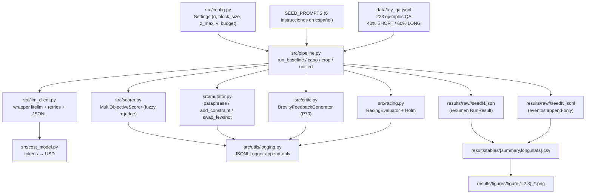

# Arquitectura de Software — CAPO × CROP (pipeline unificado)

> Propósito. Documentar la arquitectura del prototipo que implementa la integración de CAPO (optimización del costo de entrada vía *racing* con Holm-Bonferroni) y CROP (regularización del costo de salida vía *Critic LM*) en un único *pipeline* que produce prompts Pareto-óptimos sobre `(accuracy, cost_in, cost_out)`.
>
> Este documento refleja el código en `src/`, `experiments/`, `analysis/` y `tests/` a fecha de la iteración 2. Lo que aquí se describe es lo que se ejecuta cuando se corre `python -m experiments.run_all`.

---

## 1. Visión general

El proyecto expone **cuatro condiciones ejecutables** que comparten el mismo dataset, el mismo cliente LLM y el mismo esquema de logging JSONL:

| Condición | Aporte que activa | Núcleo |
|---|---|---|
| `baseline` | Prompt *seed* plano, sin optimización. | `run_baseline` |
| `capo` | *Racing* + Holm-Bonferroni + penalización por longitud. | `run_capo` |
| `crop` | Iteración con *Critic LM* que produce *feedback* de brevedad. | `run_crop` |
| `unified` | CAPO + CROP en el mismo bucle generacional. | `run_unified` |

Las cuatro funciones viven en `src/pipeline.py` y devuelven un `RunResult` (dataclass) que el `analysis/` consume tal cual. La orquestación completa se hace desde `experiments/run_all.py`, que barre condición × *seed* en modo *fail-soft*.

### 1.1 Flujo de datos



### 1.2 Lectura del flujo

1. **`config.py`** lee `.env` y construye un `Settings` inmutable con precios por modelo, hiperparámetros por defecto (`alpha=0.2`, `block_size=30`, `z_max=10`, `gamma=0.05`, `max_budget_usd=5.0`) y rutas a `data/`, `results/raw/`, `results/tables/`, `results/figures/`.
2. **`pipeline.py`** toma los `SEED_PROMPTS` (6 instrucciones curadas en español, todas con `<final_answer>...</final_answer>`) y la lista de 223 filas del dataset, las divide 60 / 20 / 20 (dev / test / holdout) y entra al bucle correspondiente a la condición.
3. **`mutator.py`** produce hijos con uno de tres operadores elegidos al azar: `paraphrase` (LLM, `temperature=0.7`), `add_constraint` (concatena una restricción de longitud/estilo) o `swap_fewshot` (regex sobre un bloque `Ejemplos:`; desactivado por defecto).
4. **`racing.py`** evalúa cada candidato en bloques crecientes y aplica Holm-Bonferroni sobre el resultado de un test pareado (`ttest` o `wilcoxon`) por bloques de `block_size` filas. Solo los `n_survive` mejores sobreviven al final del bucle.
5. **`scorer.py`** calcula `accuracy`, `cost_in_mean`, `cost_out_mean` y un escalar `score = accuracy − α·cost_in_norm − β·cost_out_norm`. Las filas `expected_short` se puntúan con `rapidfuzz.fuzz.token_set_ratio` (umbral 0.85). Las filas `expected_long` se puntúan con un juez LLM que devuelve JSON.
6. **`critic.py`** se invoca solo si la `cost_out` del candidato supera el percentil 70 del *pool*. Devuelve `rewritten`, `feedback` y `brevity_score` en JSON.
7. **`llm_client.py`** centraliza las llamadas: prefija `openai/` al modelo, inyecta `thinking: {type: disabled}` para M3, aplica reintentos con `tenacity` (3 intentos, backoff exponencial 0.5–8 s) y registra cada llamada en el JSONL global.
8. **`cost_model.py`** convierte `(tokens_in, tokens_out)` a USD usando la tabla `pricing` del `Settings` (precios MiniMax M2.5, M2.7, M2.7-highspeed, M3).

---

## 2. Desglose de Módulos

### 2.1 `src/config.py` — configuración

| Aspecto | Detalle |
|---|---|
| Responsabilidad | Cargar `.env`, validar clave API, exponer un `Settings` inmutable. |
| Salidas | `SETTINGS` (singleton) con `model`, `api_key`, `api_base`, `data_path`, `raw_dir`, `tables_dir`, `figures_dir`, `pricing`, e hiperparámetros por defecto. |
| Hiperparámetros | `alpha=0.2` (Holm), `block_size=30`, `z_max=10`, `gamma=0.05` (penalización por longitud), `max_budget_usd=5.0`. |
| Pricing | Tabla `dict[str, PricingTier]` con M2.5 ($0.20/$1.20), M2.7 ($0.30/$1.20), M2.7-highspeed ($0.60/$2.40), M3 ($0.60/$2.40). |

### 2.2 `src/data_gen.py` — dataset

| Aspecto | Detalle |
|---|---|
| Responsabilidad | Definir y persistir el dataset toy. |
| Formato | JSONL con `id`, `question`, `expected_short` (40 % de las filas), `expected_long` (60 %), `difficulty` ∈ {easy, medium, hard}. |
| Tamaño | 223 filas committeadas en `data/toy_qa.jsonl` (30 short + 193 long en el snapshot actual). |
| Loader | `load_dataset(SETTINGS.data_path)` retorna `list[dict]`. |
| Por qué propio | Control de variabilidad, *scoring* determinístico (fuzzy para SHORT), cero dependencias de HuggingFace. |

### 2.3 `src/llm_client.py` — cliente LLM

| Aspecto | Detalle |
|---|---|
| Responsabilidad | Wrapper sobre `litellm.completion`. Único punto que habla con la API. |
| Retries | `tenacity`: 3 intentos, `wait_random_exponential(multiplier=0.5, max=8)`, reintenta `RateLimitError`, `Timeout`, `APIConnectionError`, `APIError`. |
| Routing | Prefija `openai/<model>` cuando el nombre no trae slash, para enrutar por el adaptador OpenAI-compatible de MiniMax. |
| M3 | Inyecta `extra_body={"thinking": {"type": "disabled"}}` para silenciar los tokens de razonamiento en M3. M2.5-highspeed **no** soporta este flag; ver §5.5. |
| Respuesta | `LLMResponse(text, tokens_in, tokens_out, latency_ms, model, reasoning_tokens, raw)`. |
| Mock | `_enable_mock(responses)` activa respuestas deterministas sin red; lo usan los 33 tests. |
| Logging | Cada llamada se registra en el `JSONLLogger` global con `role`, `prompt_hash`, `response_hash`, `tokens_in/out`, `latency_ms`, `seed`, `error`. |

### 2.4 `src/cost_model.py` — modelo de costo

| Aspecto | Detalle |
|---|---|
| Responsabilidad | Convertir `(tokens_in, tokens_out)` a USD y agregar lotes. |
| Fuente de tokens | Siempre `usage` que devuelve la API (no `tiktoken`); este último solo se consulta para sanity checks offline. |
| Salida | `CostBreakdown(cost_in, cost_out, cost_total)` (dataclass frozen). |
| Fallback | Si el modelo no está en la tabla, devuelve `PricingTier(input=0.5, output=1.5)` por millón para no subestimar costo. |

### 2.5 `src/mutator.py` — operadores genéticos

| Aspecto | Detalle |
|---|---|
| Responsabilidad | Producir hijos a partir de padres. |
| Operadores | `paraphrase` (LLM, `temperature=0.7`, system prompt de "editor de prompts"); `add_constraint` (concatena una restricción de 4 candidatas); `swap_fewshot` (baraja un bloque `Ejemplos:` detectado por regex). |
| Distribución | `mutate_pool` elige operador con `random.random()`: 50 % paraphrase, 40 % add_constraint, 10 % swap_fewshot. |
| Robustez | `_strip_prompt_tag` maneja tres modos de fallo del modelo: tag cerrado, tag sin cerrar (cortado por `max_tokens`), o prefijo tipo "Aquí va el prompt: …". Si todo falla, devuelve el prompt original. |
| Tracing | Cada mutación emite `MutationTrace(operator, parent_prompt, child_prompt, constraint?, seed)` y un evento `mutation` en el JSONL. |

### 2.6 `src/racing.py` — RacingEvaluator (núcleo CAPO)

| Aspecto | Detalle |
|---|---|
| Responsabilidad | Evaluar candidatos en bloques crecientes y descartar perdedores por significancia estadística. |
| API | `RacingEvaluator(block_size, alpha, n_survive, z_max, pairwise_test, correction).run(candidates, dataset, evaluate_fn)`. |
| Test pareado | `pairwise_test="ttest"` (default CAPO, `scipy.stats.ttest_rel`) o `"wilcoxon"` (`scipy.stats.wilcoxon(zero_method="wilcox")`, default iteración 2 por robustez con n=5–12). |
| Corrección | `"holm"` (Holm-Bonferroni step-down, default), `"bonferroni"` (single-step), o `"none"` (raw `p ≤ α`, reproduce el paper CAPO). |
| Resultado | `RacingResult(survivors, eliminated, blocks_used, per_block_summary)`. Si quedan más de `n_survive` al final, se truncan por `mean` descendente. |
| Garantía | Si todos los candidatos rinden igual, ninguno es eliminado — invariante cubierto por `tests/test_racing.py`. |

### 2.7 `src/scorer.py` — MultiObjectiveScorer

| Aspecto | Detalle |
|---|---|
| Responsabilidad | Calcular la función objetivo combinada y producir un `CandidateScore`. |
| Extracción | `extract_final_answer` toma el contenido de `<final_answer>...</final_answer>`; si falta, devuelve el texto crudo. |
| SHORT | `rapidfuzz.fuzz.token_set_ratio` entre predicción y esperado (normalizado: lowercase, sin acentos, espacios colapsados). Binario `correct` con umbral `fuzzy_threshold=0.85`. |
| LONG | LLM-as-judge (`use_judge=True` por defecto). Prompt fijo que pide `{"score": 0..1, "reason": "..."}`. Fallback a Jaccard si `use_judge=False`. |
| Score | `score = accuracy − α·(tokens_in_mean / max_input_tokens_baseline) − β·(tokens_out_mean / max_output_tokens_baseline)`. |
| Pareto | `pareto_front(points)` calcula índices no-dominados sobre `(accuracy, −cost_in, −cost_out)`. |

### 2.8 `src/critic.py` — BrevityFeedbackGenerator (núcleo CROP)

| Aspecto | Detalle |
|---|---|
| Responsabilidad | Sugerir una versión más corta de una salida larga y puntuar su brevedad. |
| Política | `should_invoke(cost_out, pool_costs)` retorna `True` solo si `cost_out` supera el percentil 70 del pool (`sorted(pool)[int(0.7*len)]`). Pool vacío → nunca invoca. |
| System prompt | "Crítico de brevedad" — exige JSON con `rewritten`, `feedback`, `brevity_score`. |
| Parsing | `_safe_parse_json` extrae el primer bloque `{...}` del texto; si no parsea, retorna `None` y la pipeline registra `critic_parse_error`. |
| Defaults | `target_length=80` caracteres; `max_output_tokens=256`. |
| Uso | En `run_unified` se invoca solo sobre el peor superviviente (mayor `tokens_out_mean`); su `feedback` se inyecta como instrucción suave en el prompt. |

### 2.9 `src/pipeline.py` — orquestación

| Aspecto | Detalle |
|---|---|
| Responsabilidad | Las cuatro funciones de alto nivel que ejecuta `experiments/run_all`. |
| `run_baseline(seed)` | Selecciona `SEED_PROMPTS[0]`, lo evalúa con el scorer sobre `test`, registra `baseline_score`. |
| `run_capo(seed, n_generations=4, population_size=8, pairwise_test="wilcoxon", correction="holm")` | Para cada generación: corre racing sobre `dev` → muta supervivientes → siguiente generación. Re-evalúa supervivientes sobre `test` y devuelve el mejor. |
| `run_crop(seed, n_iterations=2)` | Toma un prompt verboso, lo evalúa, genera 5 ejemplos de salida, invoca al Critic y reescribe el prompt con el feedback como instrucción. |
| `run_unified(seed, ...)` | Racing + Critic: tras el racing, evalúa cada superviviente sobre `dev[:3]`, identifica al de mayor `tokens_out_mean`, genera una salida de muestra, llama al Critic si está sobre el P70, y antepone `Recordatorio de brevedad: …` al prompt. |
| `BudgetGuard` | Acumula `cost_total` por cada llamada registrada; el bucle se aborta cuando `spent ≥ max_budget_usd`. |
| `RunResult` | Dataclass inmutable con `condition`, `seed`, `final_prompt`, métricas (`accuracy`, `accuracy_short`, `accuracy_long`, `fuzzy_short_accuracy`, `judge_score_long`), costos (`tokens_in_total`, `tokens_out_total`, `cost_in_usd`, `cost_out_usd`, `cost_total_usd`), `latency_ms_mean`, `n_generations`, `n_llm_calls`, `notes`. |
| Defaults iteración 2 | `n_generations=4`, `population_size=8` (antes 2/4; los originales colapsaban a `n_survivors=0` en 5/5 seeds, ver `reports/informe.md §7.5`). |

### 2.10 `src/utils/` — utilidades

| Archivo | Detalle |
|---|---|
| `logging.py` | `JSONLLogger`: writer append-only thread-safe. Eventos `{event, ts, run_id, **kwargs}`. `log_llm_call` añade `model`, `role`, `prompt_hash`, `response_hash`, `tokens_in/out`, `latency_ms`, `seed`, `error`, `reasoning_tokens`. Singleton global vía `get_logger()` / `set_logger()`. |
| `seeds.py` | `set_seed(seed)` siembra `random`, `numpy`, `torch` (si está disponible). |
| `stats.py` | `paired_wilcoxon(a, b)` (two-sided, `zero_method="wilcox"`); `bootstrap_ci(values, n_resamples=2000, confidence=0.95)`; `cohens_d(a, b)` (Hedges' g con `ddof=1`). |

---

## 3. Gestión de Estado y Persistencia

No hay base de datos. Todo es filesystem plano. La capa de `analysis/` lee directamente los JSON/JSONL.

| Tipo de dato | Tamaño típico | Volumen esperado | Almacén | Justificación |
|---|---|---|---|---|
| Resumen por corrida | ~1 KB JSON | 4 condiciones × N seeds | `results/raw/<cond>/seed<N>.json` | Lo escribe `experiments/run_all` al cerrar cada corrida; lo lee `analysis/aggregate`. |
| Trazas detalladas | ~5 KB JSONL por corrida (cada llamada al LLM y cada evento de racing/mutación/critic) | Miles de líneas | `results/raw/<cond>/seed<N>.jsonl` | Append-only; `analysis/figures.figure3_convergence` parsea los eventos `racing_done`. |
| CSV consolidados | Décenas de KB | Constante | `results/tables/{summary,long,stats}.csv` | Salida de `analysis.aggregate` y `analysis.stats`. |
| Figuras | 3 PNG por iteración | Constante | `results/figures/figure{1,2,3}_*.png` | Generadas por `analysis.figures`. |
| Logs ad-hoc | Único | Único | `results/raw/_fallback.jsonl` | Fallback del `JSONLLogger` cuando nadie llamó a `set_logger`. |
| Dataset | 100 KB JSONL | Constante | `data/toy_qa.jsonl` (223 filas, committeado) | Reproducibilidad sin red. |

### 3.1 Esquema del JSONL

Cada línea del archivo `results/raw/<cond>/seed<N>.jsonl` es un objeto JSON plano con la forma:

```json
{"event": "llm_call",       "ts": ..., "run_id": "capo-s3", "model": "MiniMax-M2.5-highspeed",
 "role": "evaluation", "prompt_hash": "…", "response_hash": "…",
 "tokens_in": 312, "tokens_out": 87, "latency_ms": 412.3, "seed": 3, "reasoning_tokens": 65}

{"event": "racing_done",    "ts": ..., "run_id": "capo-s3", "generation": 1,
 "survivors": 4, "eliminated": 4, "blocks": 2}

{"event": "mutation",       "ts": ..., "operator": "paraphrase", "parent_len": 180, "child_len": 174}

{"event": "unified_critic", "ts": ..., "brevity_score": 0.8, "new_length": 92}

{"event": "budget_stop",    "ts": ..., "condition": "capo", "generation": 2}
```

Los eventos típicos son: `run_start`, `generation_start`, `racing_done`, `crop_iter_start`, `crop_critic_invoked`, `crop_critic_skipped`, `unified_critic`, `mutation`, `eval_error`, `judge_error`, `critic_parse_error`, `mutator_error`, `budget_stop`, `baseline_score`, `llm_call`.

---

## 4. Stack Tecnológico

| Componente | Versión | Por qué |
|---|---|---|
| Python | 3.11+ | Dataclasses, typing moderno, asyncio disponible (no usado masivamente). |
| `litellm` | `>=1.40,<2.0` | Capa única sobre la API OpenAI-compatible de MiniMax. `LLMClient` la envuelve y nada más habla con la API. |
| `tenacity` | `>=8.2,<10.0` | Reintentos con backoff exponencial por tipo de error (`RateLimitError`, `Timeout`, `APIConnectionError`, `APIError`). |
| `tiktoken` | `>=0.5,<1.0` | Solo para sanity checks offline; la verdad viene de `usage`. |
| `scipy` | `>=1.11,<2.0` | `ttest_rel` y `wilcoxon` en `racing._pairwise_pvalue`; también en `analysis.stats`. |
| `numpy` / `pandas` | NumPy `>=1.26`, pandas `>=2.1` | Bootstrap y CSVs. |
| `rapidfuzz` | `>=3.6,<4.0` | `fuzz.token_set_ratio` en `_fuzzy_short_score` (fallback a `difflib` si falta). |
| `matplotlib` | `>=3.8,<4.0` | Las tres figuras del informe. |
| `python-dotenv` | `>=1.0,<2.0` | Carga `.env` desde el repo root en `config.py`. |
| `pytest` | `>=7.4,<9.0` | 33 tests; `pytest-mock` para stubs. |
| Pydantic | `pydantic>=2.6` en `requirements.txt` | Declarado pero no usado como sistema central; el proyecto usa `dataclasses`. |
| DSPy / MLflow / W&B / DVC / Ray / Neo4j / Postgres | **No presentes** | Decisión explícita del README §2: para 1 semana, "la infraestructura mata". |

### 4.1 Lenguaje y runtime

- Todo el código corre como scripts (`python -m experiments.run_all`), no hay servicio web.
- Empaquetado informal: `requirements.txt` + `pip install`. No hay `pyproject.toml`/`poetry`/`uv`.
- Asyncio **está disponible** pero no se usa: el racing es síncrono (`for cand in survivors: scores = evaluate_fn(cand, batch)`).
- Sin Docker / contenedor.

---

## 5. Decisiones de Diseño y Limitaciones Conocidas

Estas son las decisiones que el README documenta y el código respeta.

### 5.1 Sin MLflow / W&B / DVC

JSONL + CSV basta. 33 tests + smoke + 4 figuras cubren lo que un tracker cubriría con sobrecarga 10×.

### 5.2 Dataset toy propio

223 ejemplos QA en español, hardcoded en `data_gen.py`. Evita variabilidad de HuggingFace y permite scoring determinístico (fuzzy sobre `expected_short`). Iteración 2 amplió de 63 → 223 para potencia estadística en Wilcoxon pareado.

### 5.3 Mismo modelo para objetivo y Critic

`MODEL` (default `MiniMax-M2.5-highspeed`) se usa en `LLMClient` y en `BrevityFeedbackGenerator`. Una sola cuenta, una sola factura. `BrevityFeedbackGenerator.should_invoke` mitiga el sobrecoste vía la regla del P70.

### 5.4 Dos operadores principales (`paraphrase`, `add_constraint`)

`swap_fewshot` existe pero `swap_fewshot_prob=0.0` por defecto: el dataset toy no trae ejemplos few-shot y forzarlo introduce ruido.

### 5.5 Wilcoxon + Holm-Bonferroni por defecto

- **Wilcoxon** sobre t-test pareado: más robusto con `n=5–12` por bloque (el dataset no da para más).
- **Holm-Bonferroni** sobre `correction="none"`: protege contra eliminación prematura en bloques iniciales con poca señal.
- `--correction none` reproduce el paper CAPO exacto (`ttest` sin corrección); documentado en `reports/informe.md §8.2`.

### 5.6 Política percentil 70 del Critic

Sigue al paper CROP. `should_invoke` retorna `False` si el pool está vacío (primera generación nunca paga Critic) y solo se activa si el candidato supera el cuantil 70 del pool actual.

### 5.7 `temperature=0` por defecto

`LLMClient(default_temperature=0.0)`. No garantiza igualdad bit-a-bit (la API sigue estocástica por debajo), pero reduce la varianza. `mutator.paraphrase` es la excepción que usa `temperature=0.7` para diversificar.

### 5.8 Mock LLM para tests

`tests/test_pipeline.py` y `tests/test_racing.py` activan `_enable_mock(responses)`; las 33 pruebas pasan sin red. Los *smoke tests* que sí tocan la API están excluidos del flujo CI.

### 5.9 Fuzzy match para SHORT

`rapidfuzz.fuzz.token_set_ratio` con `fuzzy_threshold=0.85` reconoce respuestas envueltas en prosa. Stdlib `difflib.SequenceMatcher` es fallback si la dependencia falta (más estricto, mismo rango `[0,1]`).

### 5.10 Tokens de razonamiento en M2.5-highspeed

`LLMResponse.reasoning_tokens` se desglosa por separado del output. En M2.5-highspeed los tokens de razonamiento ocupan el 70–99 % del output facturado; `thinking: {type: disabled}` (M3), `reasoning: {enabled: false}` y `reasoning_effort: 0` **no surten efecto** en M2.5 (ver `reports/informe.md §7.3`). `cost_model.py` los factura como output (mismo precio por millón); el pipeline puede filtrarlos si quiere.

### 5.11 Ablación Holm vs t-test por CLI

`experiments/run_all.py` acepta `--pairwise-test {ttest,wilcoxon}` y `--correction {holm,none,bonferroni}`. Las cuatro combinaciones están cubiertas por los tests de `test_racing.py`.

---

## 6. Tests

`tests/` contiene 5 archivos, **33 tests** que pasan sin red:

| Archivo | Cubre |
|---|---|
| `test_racing.py` | Invariantes de Holm-Bonferroni, no-eliminación-falsa cuando todos los candidatos rinden igual, las tres correcciones (`holm`, `none`, `bonferroni`). |
| `test_cost_model.py` | `usd_from_tokens` por modelo, `aggregate`, fallback de pricing. |
| `test_pareto.py` | `pareto_front` sobre `(accuracy, −cost_in, −cost_out)`; incluye `_enable_mock`. |
| `test_scorer.py` | `extract_final_answer`, `_fuzzy_short_score` (con y sin rapidfuzz), `_judge_long`, `MultiObjectiveScorer.aggregate`, `score_prompt` end-to-end con mock. |
| `test_pipeline.py` | Smoke tests de las cuatro condiciones con mock LLM; verifica que `RunResult.notes` refleja los kwargs (`pairwise_test`, `correction`). |

```bash
python -m pytest tests/ -v
# 33 passed
```

---

## 7. Hitos Ejecutados (estado real)

| Hito | Estado | Resultado |
|---|---|---|
| **0 — Sandbox.** Repo, `.env`, `Settings`, `LLMClient` con smoke test. | ✅ | `tests/test_pipeline.py::test_run_baseline_smoke` pasa; README §9 documenta el smoke de API. |
| **1 — Racing vertical.** `RacingEvaluator` + `CostModel` end-to-end sobre dataset juguete. | ✅ | `tests/test_racing.py` cubre las invariantes de Holm; `run_capo` corre con `--budget 5`. |
| **2 — Mutator + línea base.** `PromptMutator` con 2 operadores, primera corrida CAPO pura. | ✅ | `src/mutator.py` con `paraphrase` + `add_constraint`; `swap_fewshot` opcional. |
| **3 — CROP integrado.** `BrevityFeedbackGenerator` con política P70, primer Pareto `(acc, cost_in, cost_out)`. | ✅ | `run_unified` combina racing + critic; `pareto_front` en `scorer.py`. |
| **4 — Producción.** Concurrencia robusta, MLflow, docs. | ⏸ Fuera de scope | Decidido no-hacer por presupuesto de tiempo (README §2). El prototipo usa JSONL + CSV + 3 figuras, no MLflow. |

---

## 8. Supuestos y Deuda Técnica

### Supuestos asumidos (no validados con el paper en mano tras compactación)

- CAPO describe Holm-Bonferroni como método principal; alternativa Sidak mencionada en literatura relacionada. **En realidad**, el paper CAPO usa t-test pareado sin corrección; Holm es una adición nuestra (más conservadora, configurable vía `--correction none` para reproducir el paper exacto).
- CROP define λ como coeficiente de regularización por longitud. En nuestro código, `gamma=0.05` cumple ese rol en CAPO y `beta=0.05` en CROP; los nombres divergen del paper por motivos históricos.
- Ambos papers asumen acceso a un dataset etiquetado de evaluación. En el prototipo ese dataset es `data/toy_qa.jsonl` (223 filas, español).

### Deuda técnica explícita

1. **API no determinista.** `temperature=0` no garantiza igualdad bit-a-bit; los Wilcoxon pareados sobre 10 seeds mitigan esto.
2. **Dataset toy.** 223 ejemplos no captura BIG-bench ni GSM8K; las conclusiones son indicativas, no generales.
3. **`score_prompt` secuencial.** Un `for row in rows` síncrono; con 223 filas y `population_size=8` se hacen ~4 × 223 ≈ 900 llamadas por seed en `run_capo`. Asyncio + `httpx` lo bajaría a minutos.
4. **Sin concurrencia entre seeds.** `experiments/run_all` procesa una condición × seed a la vez; paralelizar seeds con `ProcessPoolExecutor` es trivial pero no se hizo.
5. **`mutator.paraphrase` es la única llamada que no es a `temperature=0`.** Inyecta diversidad a costa de varianza; un seed más alto en `LLMClient` ayudaría.
6. **Sin versionado de dataset.** Cambios en `data_gen.py` invalidan comparaciones históricas; un hash SHA256 del dataset en el JSONL (`dataset_sha`) está pendiente.
7. **Pydantic declarado pero no usado.** Está en `requirements.txt` por inercia; el código usa `dataclasses` puros.

### Riesgos que requieren decisión antes de escalar

- ¿Qué pasa si MiniMax cambia el formato de `usage`? `LLMClient._complete` ya tolera campos faltantes (devuelve 0) pero conviene blindar el contrato.
- ¿Vale la pena pagar `judge` LLM en CROP puro? `MultiObjectiveScorer(use_judge=False)` cae a Jaccard, mucho más barato y razonablemente correlacionado para dominios cerrados.
- ¿Subir a un dataset de 10⁴ filas? `block_size` debería escalar con `len(dev)` (ya hay clamping `max(3, min(block_size, len(dev)//2))`); el resto funciona tal cual.

---

## 9. Próximo paso natural

`reports/informe.md` (compilado a PDF vía `pandoc` + Chrome headless) recoge los resultados cuantitativos de la última corrida. `presentation/slides.md` es la fuente de la defensa. Cualquier refactor arquitectural (asyncio, dataset versionado, MLflow opcional) debería partir de ahí hacia atrás.